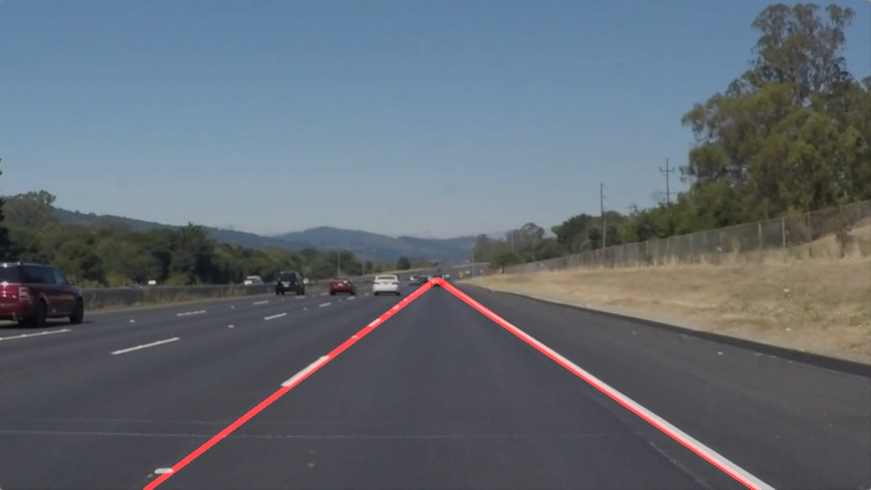

# **Finding Lane Lines on the Road** 

## Writeup 


---

**Finding Lane Lines on the Road**

The goals / steps of this project are the following:
* Make a pipeline that finds lane lines on the road
* Reflect on your work in a written report!


[//]: # (Image References)

[image1]: ./test_images/gray_solidWhiteRight.jpg "Grayscale"
[image2]: ./test_images/canny_solidWhiteRight.jpg "canny"


---


### Reflection

### 1. Description of my pipeline.

My pipeline consisted of 6 steps. First, I applied converted the images to grayscale, second I applied a gaussian_blur with a kernel of size 5, third I applied a canny filter, fourth I applied a ROI on the canny image image, fifth I applied the houghLinesP algorithm over on the canny image, and I drew the lines over the original image and sixth I merged all the lines into just two left and right lines.


#### 1.1 First step grayscale 
The original image above, is converted to grayscale.


#### 1.2 Gaussian Blur.
Although the canny filter has a filter with kernel 5 included, a prior gaussian_blur filter is applied with a kernel size of 5 to remove more noise in the image and keep just the strong edges


#### 1.3 Canny filter.
Then the canny filter is applied with the following parameters:

 - Low threshold=20
 - High threshold=60
 
 The parameters were chosen after some iterations, because they gave the best results, and the ratio 1:3 suggested was respected
 
 
 

#### 1.4 ROI MASK.

A region of interest with the form of an Isosceles Trapezoid is chosen: 

The bottom of the trapezoid is in the y coordinate y=ysize. 

The bottom x coordinates are located in x=1/15*xsize and x=14/15*xsize.

the top of the trapezoid is  located  in y= 8/14*ysize 

The top x coordinates are located in x=xsize/2-xsize/80 and x=xsize/2-xsize/80 respetively.
 
Finally these coordinates compound the vertices that feed the fillPoly function to create the ROI.
 
 
 

#### 1.5 Hough Lines.

Afterwards, the probabilistic hough Lines function was applied to the result above. 

The resolution parameters were chosen to be rho = 1 and theta = pi/180 (one degree)

The other parameters were chosen to be dependent on the height of the figures.

threshold=int(ysize/40)

min_line_len=int(ysize/30)

max_line_gap=int(ysize/100)

They were chosen after some trial and error, starting from values intuitively right. For example, if the height is 540, the max_gap is 5, the min line length is 18 and the min number of votes is 13.


The resultant hough lines were drawn in the original image with the weighted_img function provided by Udacity.

 
 


#### 1.6 Extrapolate and merge Hough Lines

In the image above, there are too much red lines.It would be better to create just one line in the left and another in the right, so, the draw lines function is modified, first to receive a boolean parameter "average_lines" if this is true, the lines are merged into junst one line, calling the function extrapolate_lines.


this extrapolate_lines function receives two list arguments and the ysize and then it extrapolates the left and right lines:


Inputs:

slopes: List with the slopes of all the lines found by hough

intercepts: List with the intercepts of all the lines found by hough


Outputs:

lines_exist: A boolean that is False if there are not enough lines to extra, so they can't be draw.


line_coords: if line_exist = True, line_coords is a list with 4 points, the x,y coordinates of the points to draw the lines in the order:
                   
                   [(x1_line1,y1_line1),(x2_line1,y2_line1),(x1_line2,y1_line2),(x2_line2,y2_line2)]

    
#### Steps: 


-All line slopes and its corresponding intercepts are appended to two list in the draw_lines function. (slopes and intercepts lists). But this only occurs for the slopes greater than 0.5 and slopes less than -0.5.

-The draw function calls the extrapolate_lines function.
    
    - It takes the index of the slopes list where slope values are possitive.
        with that information, it creates two lists, slopes_positives and its corresponding_intercepts.
    - It takes the index of the list where slope values are negative.
        with that information, it creates two lists, slopes_positives and its corresponding_intercepts.
        
        -If there are less than two negative lines, or less than two positve lines it returns an empty 
        list in line_coords  and a false lines_exist boolean.

        -Otherwise, it computes the median of the slopes negatives and the median of its interceps, given 
        the parameters for the left line, and it also computes the median of the slopes positives and the
        median of its interceps, given the parameters for the left line.

        -Median was chosen because the mean is sensitive to outliers.
        
        -It evalutes x=f(y) x=(y-b)/m in the top and bottom y values of the ROI, and for the two line functions
        (left and right line), obtaning the 2D coordinates of the four points required to draw the left and right lines. 
        -The output if the lines exist is a list with 4 elements, each corresponding to a point. The first two, are
        required 
        for the left line, and the last two are for the right line. 
        
        [(x1_line1,y1_line1),(x2_line1,y2_line1),(x1_line2,y1_line2),(x2_line2,y2_line2)]


Finally, the lines are drawn using the draw_lines function, and this image is combined with the original image.
 
 

### 2. Potential shortcomings with the current pipeline


One potential shortcoming would happen if, in the 1.6 section, the hough lines algorithm detects more lines in the road that the quantity on real lane lines that it detects, in this case, the median of the slopes would be a very different value of the expected.

Another potential shortcoming would be in the sharp curves, the hough lines could detect actual lane lines but these could have really different slope values and the median could be a not accurate value.


### 3. Possible improvements to your pipeline

A possible improvement would be to restrict more the intervale of the accepted slopes to get just the actual lane lines.

Another potential improvement could be to modify the contrast of the image in some frames to avoid the error when there are shadows in the road.


A detection of curves, would be much more efficient.

A camera calibration could help with the remotion of not desired objects like the hood of the car in the optional challange. 


```python

```
